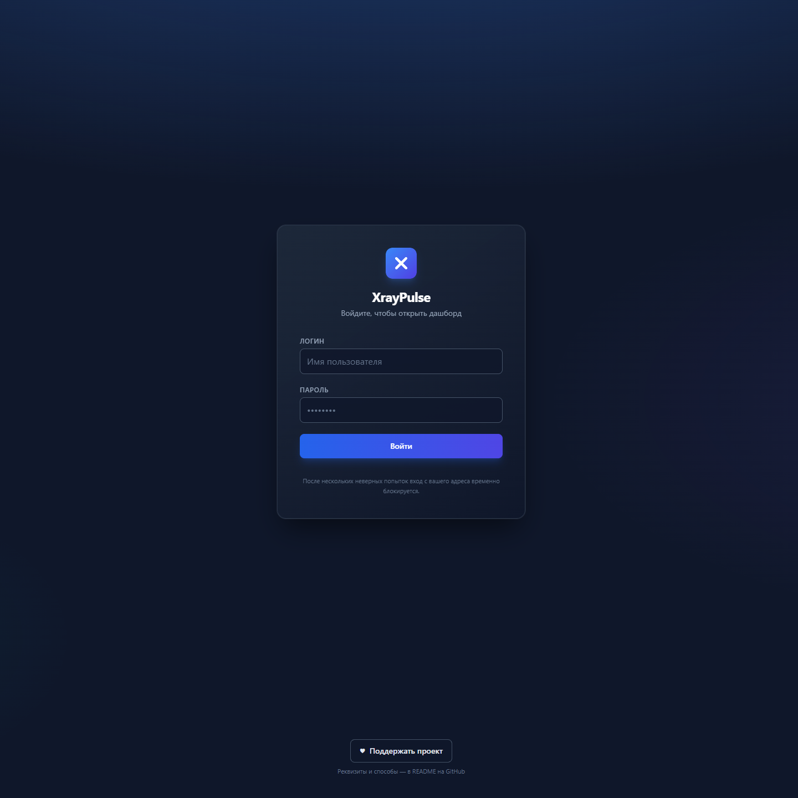
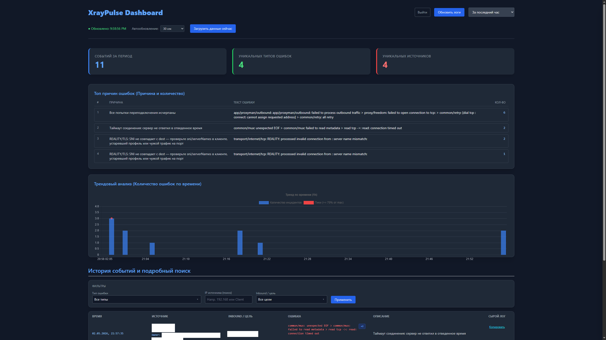
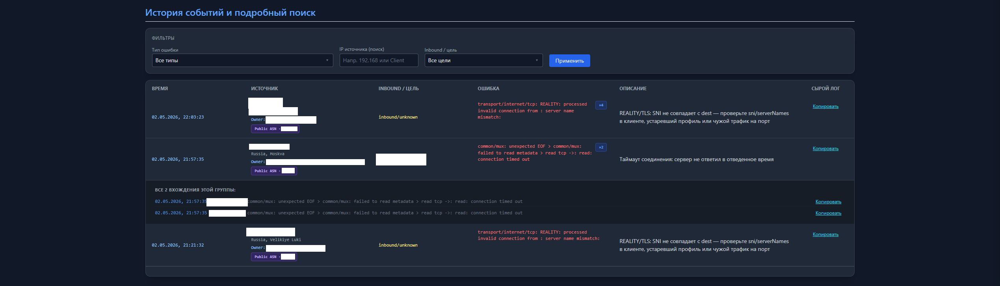
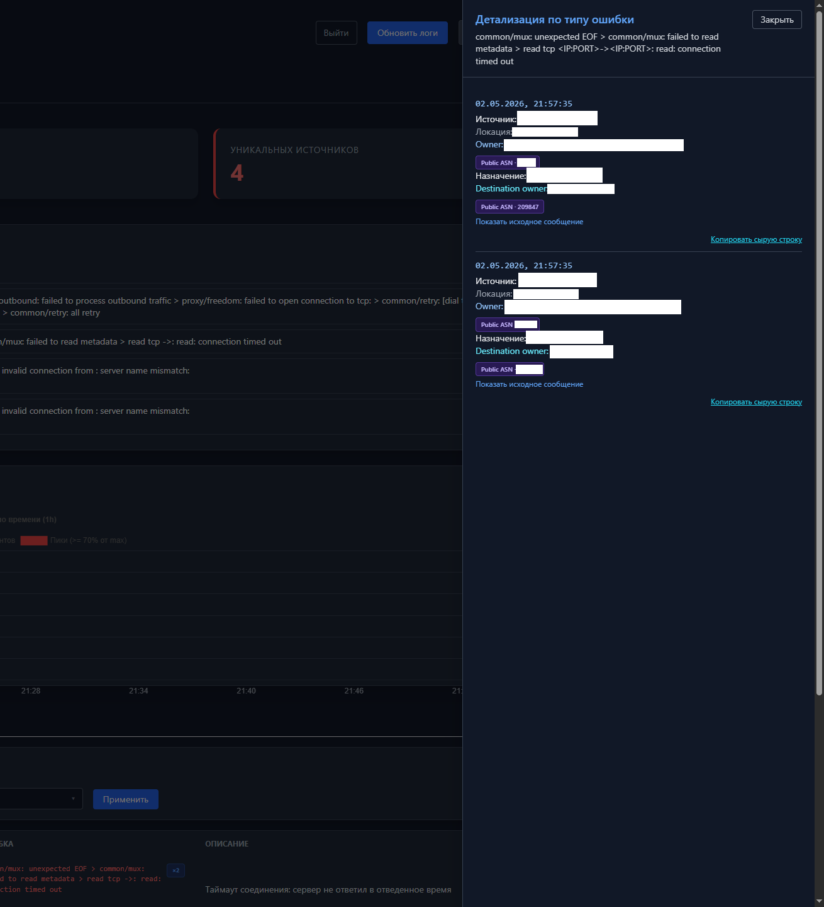

# XrayPulse

Веб-дашборд для анализа ошибок Xray из `error.log`: агрегаты, история, фильтры и обогащение IP.

**Релизы:** [GitHub Releases](https://github.com/modi-dev/XrayPulse/releases) · [CHANGELOG.md](CHANGELOG.md)

## Поддержка проекта

Если XrayPulse оказался полезен, можно поддержать развитие:

| Способ | Реквизиты |
|--------|-----------|
| Telegram | [t.me/SergeyBayer](https://t.me/SergeyBayer) |
| USDT (Tron) | `TCVnbNPFHNRQpUmQAmCwiUEt4em67YqYRn` |
| Ethereum | `0xD935400Aa57934ECdfCAE9c049C6921c146FeDa3` |

## Возможности

- Парсинг строк `error.log` (IPv4/IPv6, SNI/sslip.io и др.) и нормализация типов ошибок в SQLite.
- **История** с пагинацией, фильтрами по типу ошибки, **поиск по IP источника**, **inbound/цель**, опция **«Скрыть шум»** (скан порта / мусорный TLS — отдельно от типичных ошибок клиента).
- KPI по выбранным фильтрам, топ причин ошибок, тренд по времени.
- Детализация по типу ошибки.
- Обогащение IP (location/owner/asn) с кэшем в БД и **дневным лимитом** внешних запросов(https://ipwho.is).
- **Вход через форму** (`/login`), сессия Flask, **лимит неудачных попыток** с блокировкой по IP.

## Скриншоты

**Страница входа** — форма входа и подсказка про блокировку при переборе.



**Дашборд** — KPI за период, топ причин ошибок, тренд по времени и блок истории.



**История и поиск** — фильтры по типу ошибки, IP источника и inbound/цели; таблица с группировкой строк.



**Детализация** — боковая панель по типу ошибки: список вхождений, обогащение IP, исходное сообщение и копирование сырой строки.



## Стек

- Python 3.10+
- Flask, python-dotenv, APScheduler
- SQLite
- UI: Chart.js (CDN), Tailwind CSS (сборка в `static/css/app.css`, см. ниже)

## Быстрый старт

1. Создайте виртуальное окружение и установите зависимости:

```bash
python -m venv .venv
pip install -r requirements.txt
```

2. Скопируйте `.env.example` в `.env` и задайте как минимум **`DASHBOARD_USER`**, **`DASHBOARD_PASS`**, путь **`ERROR_LOG_PATH`**. Для прода задайте **`FLASK_SECRET_KEY`** (иначе при перезапуске сбросятся сессии).

3. Запуск:

```bash
python app.py
```

4. Откройте в браузере: [http://127.0.0.1:5000](http://127.0.0.1:5000) — при включённой авторизации откроется страница входа, затем дашборд.

## Переменные окружения

Полный список с комментариями — в **`.env.example`**. Кратко:

| Переменная | Назначение |
|------------|------------|
| `AUTH_ENABLED` | Включить вход и защиту маршрутов (`true` / `false`) |
| `DASHBOARD_USER` / `DASHBOARD_PASS` | Учётная запись дашборда |
| `FLASK_SECRET_KEY` | Секрет подписи cookie сессии |
| `AUTH_LOCKOUT_MAX_ATTEMPTS` / `AUTH_LOCKOUT_SECONDS` | Блокировка `/login` после неудачных попыток с одного IP |
| `AUTH_TRUST_X_FORWARDED` | За reverse-proxy(nginx): брать IP клиента из `X-Forwarded-For` |
| `ERROR_LOG_PATH` | Путь к `error.log` Xray |
| `ERROR_LOG_SKIP_HISTORY` / `ERROR_LOG_LINE_MARKERS` | Поведение первого чтения и фильтр строк по подстрокам |
| `GEO_LOOKUP_ENABLED` / `GEO_LOOKUP_DAILY_LIMIT` | Внешний IP lookup и лимит в день |
| `MONITOR_JOB_LOG_*` | Путь и ротация служебного лога приложения |

Загрузка `.env` выполняется с **`override=True`**: значения из файла перекрывают уже заданные в окружении ОС/IDE переменные с тем же именем (удобно, если `AUTH_ENABLED` случайно задан снаружи).

## Стили (Tailwind)

После правок классов в `templates/` или `static/js/` пересоберите CSS (нужны Node.js и npm):

```bash
npm install
npm run build:css
```

Для разработки с автопересборкой: `npm run watch:css`. В репозитории уже лежит актуальный `static/css/app.css`, чтобы дашборд работал без шага `npm`.

## Структура проекта

- `app.py` — Flask-приложение: маршруты, сессия, `/login`, API, scheduler
- `parser.py` — разбор строк лога и нормализация
- `database.py` — SQLite: события, агрегаты, история, кэш IP
- `templates/index.html` — дашборд
- `templates/login.html` — страница входа
- `static/js/app.js` — загрузка данных, графики, таблица, фильтры

## Примечания

- База создаётся автоматически: **`xray_monitor.db`** (рядом с приложением, если не менять логику путей).
- Для локальной отладки без пароля: **`AUTH_ENABLED=false`** в `.env`.
- За **nginx** с TLS обычно нужны **`AUTH_TRUST_X_FORWARDED=true`** (корректный IP для блокировки входа) и проксирование заголовков; приложение слушает по умолчанию `127.0.0.1:5000` — см. `app.py` для смены хоста/порта.

